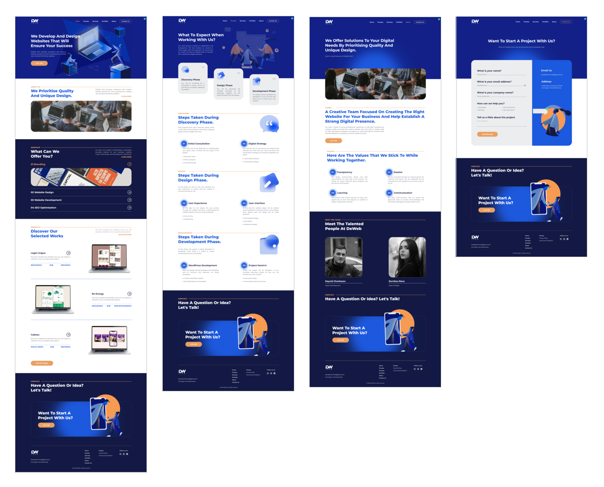

# DeWeb Tech

## [Live Site](https://deweb-prototype.netlify.app)

 

## Description

A website prototype, that was created following the available Figma design (not fully functional yet).

 

## Screenshots

 

## 🛠️ Built with:

 

## 💾 Installation

- Clone the repository: `git clone https://github.com/rado-kolev/deweb.git`.
- If using VS Code, open the `index.html` file and open the website with 'Live Server' or if using a different code editor, open the website with the available localhost.
